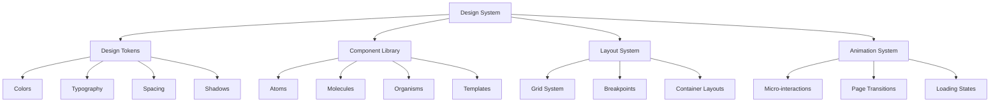
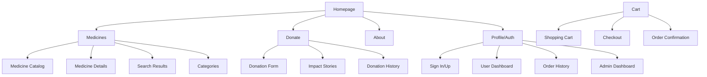

# Design Document

## Overview

This design document outlines the comprehensive modernization of the FlickXir healthcare platform's user interface and user experience. The redesign focuses on creating a contemporary, accessible, and user-centric design that enhances user engagement, builds trust, and improves conversion rates across all platform functionalities.

The design approach emphasizes clean aesthetics, intuitive navigation, responsive layouts, and meaningful interactions that align with modern web standards and user expectations in the healthcare domain.

## Architecture

### Design System Architecture



### Information Architecture



## Components and Interfaces

### 1. Design System Foundation

#### Color Palette
```css
/* Primary Colors */
--primary-50: #f0f9ff;
--primary-100: #e0f2fe;
--primary-500: #0ea5e9;
--primary-600: #0284c7;
--primary-700: #0369a1;

/* Secondary Colors */
--secondary-50: #f8fafc;
--secondary-100: #f1f5f9;
--secondary-500: #64748b;
--secondary-600: #475569;
--secondary-700: #334155;

/* Accent Colors */
--accent-green: #10b981;
--accent-orange: #f59e0b;
--accent-red: #ef4444;

/* Neutral Colors */
--gray-50: #f9fafb;
--gray-100: #f3f4f6;
--gray-200: #e5e7eb;
--gray-300: #d1d5db;
--gray-400: #9ca3af;
--gray-500: #6b7280;
--gray-600: #4b5563;
--gray-700: #374151;
--gray-800: #1f2937;
--gray-900: #111827;
```

#### Typography System
```css
/* Font Families */
--font-primary: 'Inter', -apple-system, BlinkMacSystemFont, sans-serif;
--font-secondary: 'Poppins', sans-serif;
--font-mono: 'JetBrains Mono', monospace;

/* Font Sizes */
--text-xs: 0.75rem;    /* 12px */
--text-sm: 0.875rem;   /* 14px */
--text-base: 1rem;     /* 16px */
--text-lg: 1.125rem;   /* 18px */
--text-xl: 1.25rem;    /* 20px */
--text-2xl: 1.5rem;    /* 24px */
--text-3xl: 1.875rem;  /* 30px */
--text-4xl: 2.25rem;   /* 36px */
--text-5xl: 3rem;      /* 48px */

/* Font Weights */
--font-light: 300;
--font-normal: 400;
--font-medium: 500;
--font-semibold: 600;
--font-bold: 700;
```

#### Spacing System
```css
/* Spacing Scale */
--space-1: 0.25rem;   /* 4px */
--space-2: 0.5rem;    /* 8px */
--space-3: 0.75rem;   /* 12px */
--space-4: 1rem;      /* 16px */
--space-5: 1.25rem;   /* 20px */
--space-6: 1.5rem;    /* 24px */
--space-8: 2rem;      /* 32px */
--space-10: 2.5rem;   /* 40px */
--space-12: 3rem;     /* 48px */
--space-16: 4rem;     /* 64px */
--space-20: 5rem;     /* 80px */
--space-24: 6rem;     /* 96px */
```

### 2. Component Library

#### Button Components
```jsx
// Primary Button
<Button variant="primary" size="lg" icon="arrow-right">
  Get Started
</Button>

// Secondary Button
<Button variant="secondary" size="md" outline>
  Learn More
</Button>

// Icon Button
<Button variant="ghost" size="sm" iconOnly>
  <SearchIcon />
</Button>
```

#### Card Components
```jsx
// Medicine Card
<MedicineCard
  image="/medicine-image.jpg"
  title="Paracetamol 500mg"
  price="₹25.00"
  rating={4.5}
  inStock={true}
  onAddToCart={handleAddToCart}
  onViewDetails={handleViewDetails}
/>

// Feature Card
<FeatureCard
  icon={<HeartIcon />}
  title="Donate Medicines"
  description="Help others by donating unused medicines"
  action="Start Donating"
  href="/donate"
/>
```

#### Form Components
```jsx
// Input Field
<InputField
  label="Email Address"
  type="email"
  placeholder="Enter your email"
  error={errors.email}
  icon={<MailIcon />}
  required
/>

// Select Field
<SelectField
  label="Medicine Type"
  options={medicineTypes}
  placeholder="Select type"
  searchable
/>
```

### 3. Page-Specific Designs

#### Homepage Design
- **Hero Section**: Full-width hero with gradient background, compelling headline, and prominent CTA
- **Features Section**: Three-column grid showcasing key platform benefits
- **Medicine Showcase**: Horizontal scrolling carousel of featured medicines
- **Impact Statistics**: Animated counters showing donation impact
- **Testimonials**: Customer testimonials with photos and ratings
- **Newsletter Signup**: Modern email capture with incentive

#### Medicine Catalog Design
- **Header**: Search bar with filters, sorting options, and view toggles
- **Sidebar Filters**: Collapsible filter panel with categories, price range, ratings
- **Product Grid**: Responsive grid with hover effects and quick actions
- **Pagination**: Modern pagination with load more option
- **Empty States**: Helpful empty states for no results

#### Donation Flow Design
- **Progress Indicator**: Multi-step progress bar with clear labeling
- **Form Sections**: Grouped form fields with clear validation
- **Image Upload**: Drag-and-drop interface with preview
- **Confirmation**: Summary page with edit options
- **Success State**: Celebratory confirmation with social sharing

#### Admin Dashboard Design
- **Sidebar Navigation**: Collapsible sidebar with icons and labels
- **Dashboard Cards**: KPI cards with charts and trends
- **Data Tables**: Sortable, filterable tables with bulk actions
- **Form Modals**: Overlay modals for quick actions
- **Analytics Charts**: Interactive charts and graphs

## Data Models

### Design Token Structure
```typescript
interface DesignTokens {
  colors: {
    primary: ColorScale;
    secondary: ColorScale;
    accent: ColorScale;
    neutral: ColorScale;
    semantic: SemanticColors;
  };
  typography: {
    fontFamilies: FontFamilies;
    fontSizes: FontSizes;
    fontWeights: FontWeights;
    lineHeights: LineHeights;
  };
  spacing: SpacingScale;
  shadows: ShadowScale;
  borderRadius: BorderRadiusScale;
  breakpoints: Breakpoints;
}
```

### Component Props Structure
```typescript
interface ButtonProps {
  variant: 'primary' | 'secondary' | 'ghost' | 'danger';
  size: 'sm' | 'md' | 'lg';
  disabled?: boolean;
  loading?: boolean;
  icon?: ReactNode;
  iconPosition?: 'left' | 'right';
  fullWidth?: boolean;
  onClick?: () => void;
  children: ReactNode;
}

interface MedicineCardProps {
  id: string;
  image: string;
  title: string;
  description: string;
  price: number;
  originalPrice?: number;
  rating: number;
  reviewCount: number;
  inStock: boolean;
  badges?: string[];
  onAddToCart: (id: string) => void;
  onViewDetails: (id: string) => void;
}
```

## Error Handling

### User-Friendly Error States
1. **Network Errors**: Friendly messages with retry options
2. **Validation Errors**: Inline validation with helpful suggestions
3. **404 Pages**: Custom 404 with navigation suggestions
4. **Empty States**: Helpful empty states with clear actions
5. **Loading Failures**: Graceful degradation with fallback content

### Error Message Design
```jsx
<ErrorMessage
  type="validation"
  message="Please enter a valid email address"
  suggestion="Example: user@example.com"
  icon={<AlertIcon />}
/>

<ErrorBoundary
  fallback={<ErrorFallback />}
  onError={logError}
>
  <ComponentTree />
</ErrorBoundary>
```

## Testing Strategy

### Visual Testing
1. **Cross-browser Testing**: Chrome, Firefox, Safari, Edge
2. **Device Testing**: Desktop, tablet, mobile viewports
3. **Accessibility Testing**: Screen readers, keyboard navigation
4. **Performance Testing**: Core Web Vitals, loading times
5. **Usability Testing**: User journey testing, A/B testing

### Component Testing
```jsx
// Button Component Tests
describe('Button Component', () => {
  it('renders with correct variant styles', () => {
    render(<Button variant="primary">Click me</Button>);
    expect(screen.getByRole('button')).toHaveClass('btn-primary');
  });

  it('handles loading state correctly', () => {
    render(<Button loading>Loading</Button>);
    expect(screen.getByRole('button')).toBeDisabled();
    expect(screen.getByTestId('loading-spinner')).toBeInTheDocument();
  });
});
```

### Responsive Design Testing
```css
/* Breakpoint Testing */
@media (max-width: 640px) {
  .medicine-grid {
    grid-template-columns: 1fr;
    gap: var(--space-4);
  }
}

@media (min-width: 641px) and (max-width: 1024px) {
  .medicine-grid {
    grid-template-columns: repeat(2, 1fr);
    gap: var(--space-6);
  }
}

@media (min-width: 1025px) {
  .medicine-grid {
    grid-template-columns: repeat(3, 1fr);
    gap: var(--space-8);
  }
}
```

## Animation and Interaction Design

### Micro-interactions
```css
/* Button Hover Effects */
.btn-primary {
  transition: all 0.2s ease-in-out;
  transform: translateY(0);
}

.btn-primary:hover {
  transform: translateY(-2px);
  box-shadow: 0 8px 25px rgba(14, 165, 233, 0.3);
}

/* Card Hover Effects */
.medicine-card {
  transition: transform 0.3s ease, box-shadow 0.3s ease;
}

.medicine-card:hover {
  transform: translateY(-4px);
  box-shadow: 0 20px 40px rgba(0, 0, 0, 0.1);
}
```

### Page Transitions
```jsx
// Framer Motion Page Transitions
const pageVariants = {
  initial: { opacity: 0, y: 20 },
  in: { opacity: 1, y: 0 },
  out: { opacity: 0, y: -20 }
};

const pageTransition = {
  type: 'tween',
  ease: 'anticipate',
  duration: 0.5
};

<motion.div
  initial="initial"
  animate="in"
  exit="out"
  variants={pageVariants}
  transition={pageTransition}
>
  <PageContent />
</motion.div>
```

### Loading States
```jsx
// Skeleton Loading Components
<SkeletonLoader>
  <SkeletonCard />
  <SkeletonCard />
  <SkeletonCard />
</SkeletonLoader>

// Progressive Image Loading
<ProgressiveImage
  src="/high-res-image.jpg"
  placeholder="/low-res-placeholder.jpg"
  alt="Medicine image"
  className="medicine-image"
/>
```

## Accessibility Considerations

### WCAG 2.1 AA Compliance
1. **Color Contrast**: Minimum 4.5:1 ratio for normal text
2. **Keyboard Navigation**: Full keyboard accessibility
3. **Screen Reader Support**: Proper ARIA labels and roles
4. **Focus Management**: Visible focus indicators
5. **Alternative Text**: Descriptive alt text for images

### Implementation Examples
```jsx
// Accessible Button
<button
  aria-label="Add Paracetamol to cart"
  aria-describedby="medicine-price"
  className="btn-primary"
  disabled={!inStock}
>
  Add to Cart
</button>

// Accessible Form
<form role="form" aria-labelledby="donation-form-title">
  <h2 id="donation-form-title">Medicine Donation Form</h2>
  <fieldset>
    <legend>Medicine Details</legend>
    <InputField
      id="medicine-name"
      label="Medicine Name"
      required
      aria-describedby="medicine-name-help"
    />
    <div id="medicine-name-help" className="help-text">
      Enter the full name of the medicine including dosage
    </div>
  </fieldset>
</form>
```

## Performance Optimization

### Core Web Vitals Targets
- **Largest Contentful Paint (LCP)**: < 2.5 seconds
- **First Input Delay (FID)**: < 100 milliseconds
- **Cumulative Layout Shift (CLS)**: < 0.1

### Optimization Strategies
1. **Image Optimization**: WebP format, lazy loading, responsive images
2. **Code Splitting**: Route-based and component-based splitting
3. **Caching**: Service worker caching, CDN optimization
4. **Bundle Optimization**: Tree shaking, minification
5. **Critical CSS**: Above-the-fold CSS inlining

```jsx
// Lazy Loading Implementation
const MedicineDetails = lazy(() => import('./MedicineDetails'));

<Suspense fallback={<MedicineDetailsSkeleton />}>
  <MedicineDetails medicineId={id} />
</Suspense>

// Image Optimization
<Image
  src="/medicine-image.jpg"
  alt="Paracetamol 500mg"
  width={300}
  height={200}
  loading="lazy"
  placeholder="blur"
  blurDataURL="data:image/jpeg;base64,..."
/>
```

This design document provides a comprehensive foundation for modernizing the FlickXir platform's UI/UX. The design system ensures consistency, the component library promotes reusability, and the detailed specifications guide implementation while maintaining high standards for accessibility and performance.